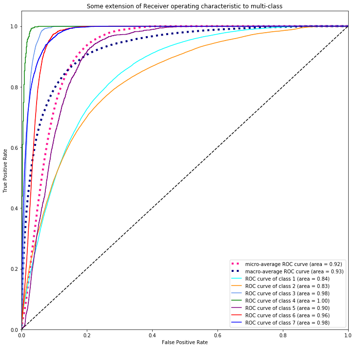
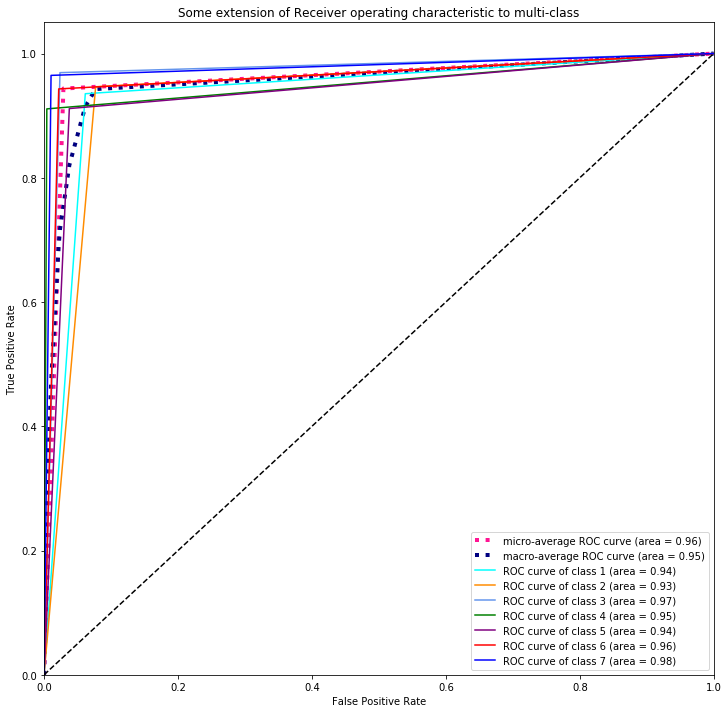
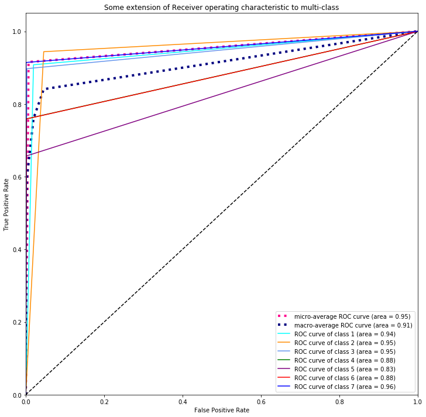

# Tree_Cover_Classification_Project

## Business Case

US government has hired Data Scientists to study four key areas in the Roosevelt National Forest of northern Colorado. Each observation is a 30m x 30m patch. We were asked to predict classification for the forest cover types using forest characterists. The seven types are:

1 - Spruce/Fir 2 - Lodgepole Pine 3 - Ponderosa Pine 4 - Cottonwood/Willow 5 - Aspen 6 - Douglas-fir 7 - Krummholz

Our mission is to develop a robust and high performing model that can predict the forest cover types based on certain predictor variables. This is important to our client as they want to preserve the forest and need to be able to identify which trees they have in the forest.

This dataset is consists of a mix of both categorical and continuous variables. These variables describe the geology of each sample forest region, and a multiclass label (one of seven possible tree cover types) serves as our target variable.

A baseline line logistic model was created and ploted a ROC curve to see the performance of our model. The graph below shows the ROC Curve for each curve which used One vs Rest. Then the mirco and macro average is calulated and is plotted on the curve too. The AUC score for mirco and maro are 0.92 and 0.93

Using a Decision Tree on the dataset, the criterion used was gini and because with have a class imbalance in our dataset we used 'balanced' in the class_weight function to fix this issue. AUC score for micro and macro imporved to 0.96 and 0.95

Using a Random Forest on the dataset, 'balanced' in the class_weight function is also used to fix the imbalance issue in the class. AUC score for micro and macro achieved 0.95 and 0.91

## Conclusion
In conclusion the best model which achieved the highest AUC score was the Decision Tree. The high AUC score (0.96) suggest the model is very good at distinguishing between different forest cover types based on certain predictor variables.
